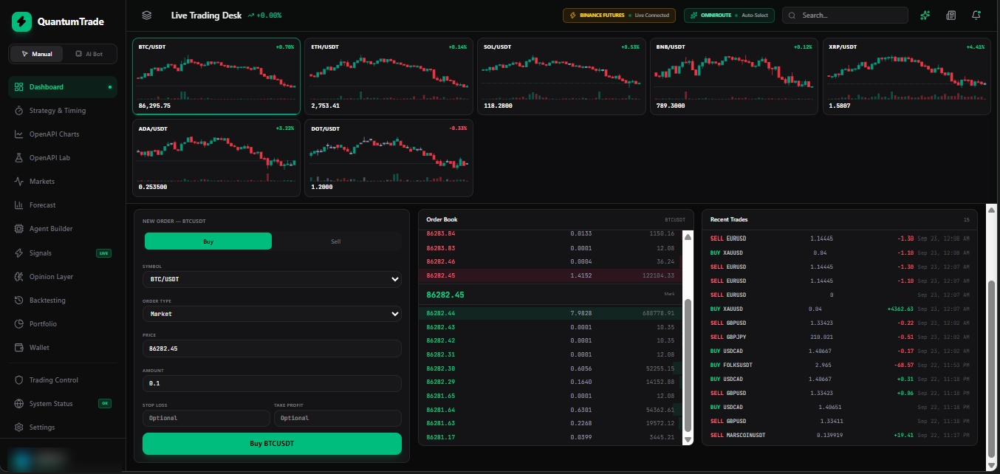
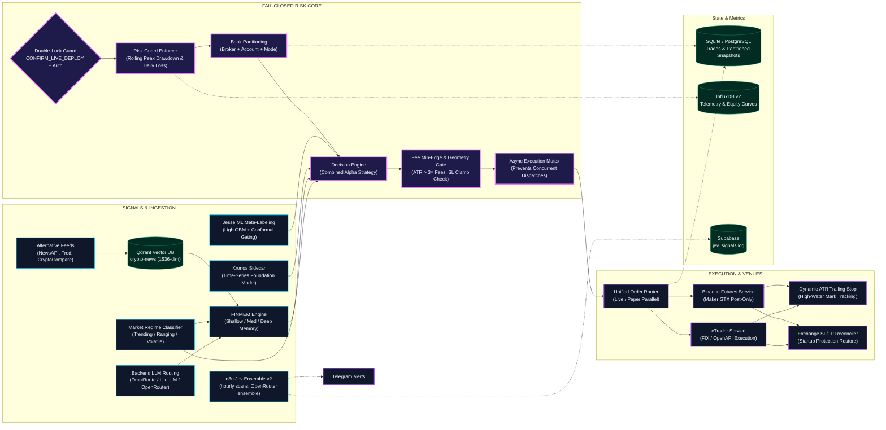
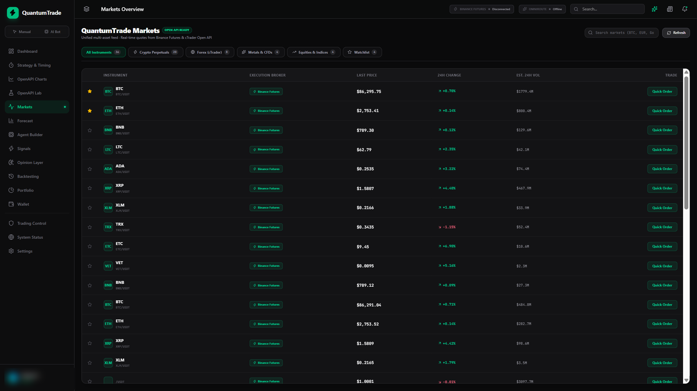
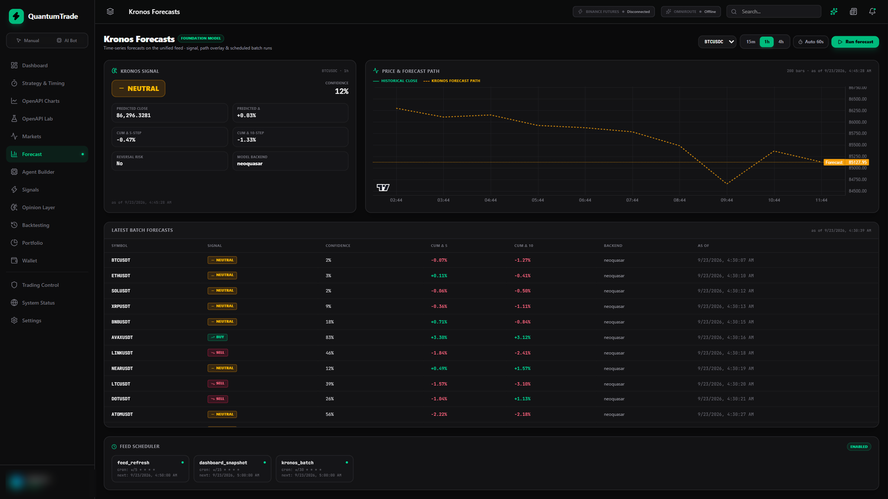
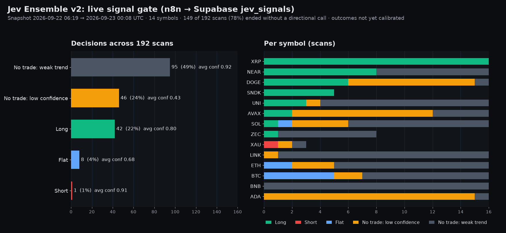

# QuantumTrade Pro — Institutional Quantitative Trading Platform

<div align="center">



[](LICENSE)
[](https://www.python.org/downloads/)
[](docker-compose.yml)
[](https://fastapi.tiangolo.com)
[](https://qdrant.tech/)
[](backend/tests/)
[](backend/security.py)

**Autonomous Multi-Broker Quantitative Execution Engine with Conformal ML Gating, FINMEM Stratified Memory, and Fail-Closed Risk Enforcers.**

[Dashboard](#live-dashboard) • [Architecture](#system-architecture) • [Signal Gate](#jev-ensemble-signal-gate) • [Quant Stack](#institutional-quant-stack) • [Risk & Safety](#fail-closed-safety-stack) • [Deployment](#quickstart--production-deployment) • [API & Telemetry](#api-telemetry--monitoring)

</div>

---

## Overview

**QuantumTrade Pro** is an institutional-grade algorithmic trading and risk execution system designed for continuous 24/7 autonomous operation across **Binance Futures** (crypto perpetuals) and **cTrader** (institutional FX and metals).

Evolving beyond simple rule-based bots or conversational agent experiments, the platform implements a **rigorous quantitative pipeline**:
- **Execution Architecture**: Non-blocking asynchronous event loop with serialized per-symbol execution locks and GTX maker order routing.
- **Fail-Closed Safety**: Double-locked live deployment authorization, rolling drawdown halts, exchange clamp validation, and strict book partitioning (`broker + account_id + mode`).
- **Conformal Machine Learning**: LightGBM meta-labeling trained on Triple-Barrier events with purged cross-validation, sample uniqueness weighting, and split-conformal uncertainty intervals.
- **Cognitive Memory Layer**: Stratified FINMEM vector memory in Qdrant across shallow (14d), intermediate (90d), and deep (365d) reflection horizons.

---

## System Architecture

The platform is split into three layers, with GitHub rendering the diagram below directly from the source:
- **Signals & Ingestion**: alternative news feeds, sentiment analysis, Qdrant vector retrieval, FINMEM stratified memory, Kronos time-series forecasting, Jesse ML meta-models, and the n8n Jev Ensemble workflow.
- **Fail-Closed Risk Core**: dual-mode session routing, rolling-peak drawdown gates, directional exposure caps, min-edge fee filters, and affirmative live guards.
- **Execution & Venue Management**: GTX maker routing on Binance, FIX/OpenAPI dispatch on cTrader, dynamic ATR trailing stops, and startup exchange SL/TP restoration.



---

## Live Dashboard

Real captures from the production deployment: Binance Futures live, OmniRoute auto-select, system status OK (user name and balance blurred). The Markets and Forecast captures came from a browser session without backend auth, so their status chips read offline.

| Live trading desk | Markets overview |
|---|---|
|  |  |

<div align="center">



Kronos foundation-model forecasts with batch runs across the unified feed.

</div>

**Price feed check.** Desk prices at capture time vs [CoinMarketCap](https://coinmarketcap.com/) quotes (2026-09-23 01:52 UTC):

| Pair | Dashboard | CoinMarketCap | Diff |
|---|---:|---:|---:|
| BTC/USDT | 86,295.75 | 86,230.99 | +0.08% |
| ETH/USDT | 2,753.41 | 2,749.16 | +0.15% |
| SOL/USDT | 118.28 | 118.12 | +0.14% |
| BNB/USDT | 789.30 | 788.64 | +0.08% |
| XRP/USDT | 1.5807 | 1.5823 | -0.10% |
| ADA/USDT | 0.2535 | 0.2529 | +0.25% |

Differences are expected: the desk reads Binance Futures perpetuals, CoinMarketCap is a volume-weighted spot aggregate.

---

## Jev Ensemble Signal Gate

The n8n Jev Ensemble v2 workflow scans the Binance Futures watchlist every hour, runs an OpenRouter ensemble decision per symbol, sends Telegram alerts, and logs every decision to Supabase (`jev_signals`). Most scans end without a directional call, which is the gate doing its job. Chart built from real rows; outcomes are not calibrated yet, so this shows selectivity, not profitability.



---

## Institutional Quant Stack

The platform embeds financial machine learning practices inspired by Marcos López de Prado:

### 1. Robust Validation Metrics
- **Promotion Contract v1.0.0**: Train→serve is fail-closed. The GPU job and Decision Engine must agree on `geometry.json`, `metrics.json`, feature-schema hashes, and deterministic gates (`REJECT` / `SHADOW` / `PROMOTE` / `ROLLBACK`). See [`docs/ml/qtp-promotion-contract/`](docs/ml/qtp-promotion-contract/).
- **Deflated Sharpe Ratio (DSR)**: Probability in $[0,1]$ from `purgedcv.deflated_sharpe_ratio` / `_full` on **costed** returns, using `effective_n_trials` or `TrialSharpeRecorder.n_effective()` — never raw Optuna `n_trials`. House gate $DSR \ge 0.95$.
- **Probability of Backtest Overfitting (PBO)**: Full completed-trial returns matrix via `purgedcv.probability_of_backtest_overfitting`. House gate $PBO < 0.30$. Infeasible or winner-only matrices are hard `REJECT`.
- **Purged K-Fold with Temporal Embargo**: Inner `PurgedKFold`; outer `CombinatorialPurgedCV` + `reconstruct_paths`. Sealed holdout is not a CPCV fold.

### 2. Triple-Barrier Labeling & Conformal Meta-Models
- **Triple Barrier Method**: Signals are labeled using dynamic upper take-profit, lower stop-loss (volatility-adjusted via ATR), and time-out horizontal barriers. House lock: **SL 1.75 ATR / PT 5.5 ATR** (training geometry must match live).
- **Sample Uniqueness Concurrency Weighting**: Overlapping trade windows are down-weighted by inverse concurrency to eliminate label redundancy.
- **Split-Conformal Uncertainty Gating**: Calibrated LightGBM models output non-conformity scores; candidates with excessive prediction intervals are vetoed before touching capital.
- **Fractional Kelly Sizing**: Allocations scale proportionally to model edge and uncertainty while strictly capping max directional exposure.

### 3. FINMEM Stratified Vector Memory
- **Stratified Storage in Qdrant**:
  - *Shallow Tier* ($Q=14$ days, decay factor $\alpha=0.900$): Tracks high-frequency market regimes and short-term volatility shocks.
  - *Intermediate Tier* ($Q=90$ days, decay factor $\alpha=0.967$): Captures quarterly macro rotations, central bank cycles, and earnings seasons.
  - *Deep Tier* ($Q=365$ days, decay factor $\alpha=0.988$): Retains historical structural extremes, flash crashes, and liquidity regimes.
- **Dynamic Cognitive Persona Switching**: Automatically modulates between *Risk-Seeking* and *Risk-Averse* behavioral profiles depending on market condition consensus and trailing drawdown.

---

## Fail-Closed Safety Stack

| Safety Layer | Implementation | Fail-Safe Behavior |
|---|---|---|
| **Live Deploy Double-Lock** | `CONFIRM_LIVE_DEPLOY=true` + `ADMIN_API_KEY` | Refuses process startup if either flag or authentication token is missing. |
| **API Boundary Lockdown** | Constant-time HMAC on all `/trading/*` routes | Blocks unauthorized information dumps of positions, balances, or bot telemetry (401/403). |
| **Image Worker Ceiling** | Dockerfile CMD set to `--workers 1` | Prevents split-brain loops, duplicate pyramid maps, and concurrency collisions. |
| **Fail-Safe Testnet Fallback** | Compose default `${BINANCE_TESTNET:-true}` | If `.env` omits the testnet flag, the platform defaults to simulated execution. |
| **Rolling Peak Drawdown** | Lookback window of 72 hours (configurable) | Halts new entries when equity drops below limit (20%) in live production; sandbox suppress is ignored if any live-cash book exists (split cTrader demo + Binance live stays fail-closed on the live book). Exits continue running. |
| **Multi-Broker Isolation** | `broker + account_id + mode` partitioning | Paper Binance fills never alter cTrader live equity or trip live risk boundaries. Demo cTrader + live Binance is labeled `split_book`; kill/drawdown use the live-cash book only (`EQUITY_RISK_SCOPE=broker`). |
| **Sentry Auto-Resume** | `SENTRY_AUTO_RESUME_LIVE_CONFIRM=I_UNDERSTAND` | Paper defaults ON. Live cash defaults OFF even if `SENTRY_AUTO_RESUME_ENABLED=true`. |
| **Sentiment Gate** | `SENTIMENT_FILTER_ENABLED` (default `false`) | n8n / native sentiment_loop are dashboards + opinion context only unless this flag is explicitly enabled. |
| **Maker GTX Execution** | Post-only orders with market fallback | Captures maker rebates (0.02% vs 0.05% taker fees); cancels orders that would cross the spread. |
| **Broker Clamp Guard** | Minimum stop-pip distance & effective R:R gate | Rejects trade setups whose planned risk:reward is crushed by broker-enforced minimum stops. |

---

## Quickstart & Production Deployment

### 1. Prerequisites
- Docker 24.0+ & Docker Compose v2+
- Node.js 18+ (for local frontend cockpit development)
- Python 3.11+ (for local scripts or backtest runners)

### 2. Environment Setup
```bash
# Clone the repository
git clone https://github.com/inimene84/ai-trading-platform.git
cd ai-trading-platform

# Copy example environment configuration
cp .env.example .env

# Generate a strong 256-bit Admin API Key
python3 -c "import secrets; print('ADMIN_API_KEY=' + secrets.token_hex(32))" >> .env
```

### 3. Launch Services via Docker Compose
```bash
# Launch core platform: backend, litellm, and nginx proxy
docker compose up -d

# Check running container health
docker compose ps
```

### 4. Verify System Health
```bash
# Public health check
curl -s http://localhost:8001/health

# Authenticated trading status check (ADMIN_API_KEY from the environment)
curl -s -H "X-API-Key: ${ADMIN_API_KEY}" http://localhost:8001/trading/status
```

---

## API, Telemetry & Monitoring

- **REST API & Documentation**: Available at `http://localhost:8001/docs` (OpenAPI) and `http://localhost:8001/redoc`.
- **Grafana Dashboards**: Port `3000` (time-series PnL, open margin, trade duration, Sharpe ratio).
- **InfluxDB v2 Metrics**: Port `8086` (bucket: `news-sentiment`, `trading-system`).
- **Qdrant Vector Console**: Port `6333` (collections: `crypto-news`, `trade-memory`, `finmem-memory`).
- **Telegram Watchdog**: Real-time push notifications on entry fills, trailing stop activations, and risk halts.

---

## Repository Hygiene & Upstream Attribution

- **License**: Distributed under the [Apache License 2.0](LICENSE).
- **Original Fork Attribution**: This platform originated as a fork of [`virattt/ai-hedge-fund`](https://github.com/virattt/ai-hedge-fund) (Copyright 2024 virattt and contributors). It has been completely rebuilt as an institutional-grade, multi-broker automated algorithmic execution system.

---

## Disclaimer

This software is for **research, educational, and quantitative development purposes only**. Algorithmic trading in leveraged perpetual futures, foreign exchange, and derivative contracts involves substantial risk of loss. Past backtested performance is not indicative of future results. No financial advice or warranties are provided.
